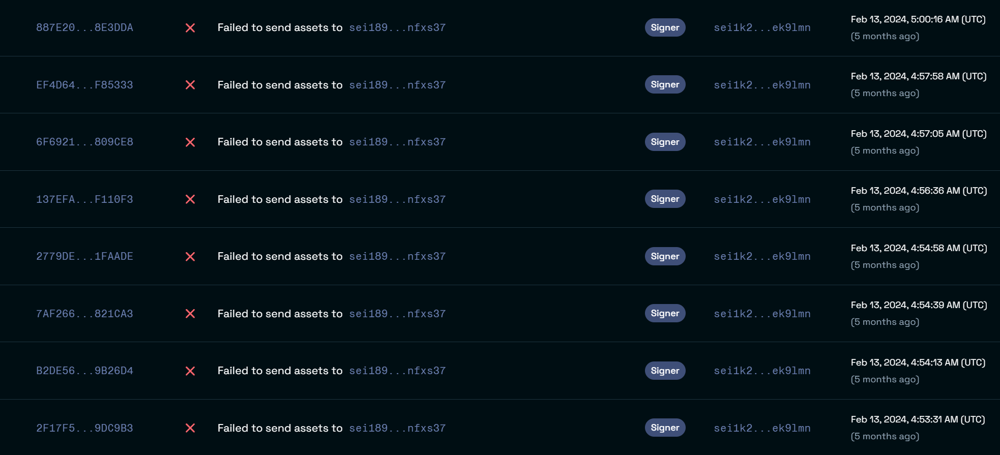

# Quick exchange $40K exploit

Resume: I gambled on top of the probability of they not validating if the txn was processed successfully or not (and I was right).

## ❓ What is Quick Exchange

Quick exchange was a NFT marketplace project Powered by smart wallets, wich in the end was basically a web2 app that indexed web3 transactions in order to work.

## ⚙️ How it worked?

Basically my "thesis" was that since the chain was new, they probably would not know some technical stuff, **a cosmos failed transaction needs to be checked inside the "response"** body if failed or not, otherwise you would have a **false-positive approved transaction** that is due to the fact that the **request includes the information you would need**, like balances or transaction instructions, the problem was that **the request always exist even if the transaction fails.**

Also the real problem was that **they did not use a smart contract**, otherwise **this would never work**, basically they were indexing the transactions related to their smart wallet, another reason to belive that this issue would exist.

The code can be found [here](./script.ts).

### Step 1

Send a transaction with the amount of n "credits" you wanted in their platform, **(needed to be greather than your balance, in order to fail and the value be indexed by them)**

### Step 2

Hit their API endpoint to validate the transaction in order to have the credits processed **(sometimes it would fail, so we just spam)**

### Step 3

Claim using their website UI as you would be doing a withdrawl, and that's all!

### Conclusion

Always use smart contracts since you would not need to index stuff, and it would be safer, and if you are on web3, do web3.

The funds were return even that they scammed it back later on.